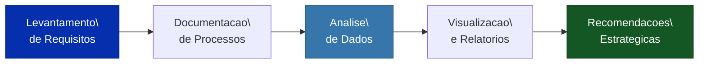

# IBM Business Analyst Capstone

<div align="center">


[](Dockerfile)

**[PT-BR](#sobre-o-projeto) | [English](#about-the-project)**

</div>

---

<a name="sobre-o-projeto"></a>

## Sobre o Projeto

> Projeto Capstone do certificado profissional **IBM Business Analyst** no [Coursera](https://www.coursera.org/)

Este projeto aplica tecnicas de analise de negocios para coletar, documentar e analisar requisitos de negocio, demonstrando competencias em levantamento de requisitos, documentacao de processos e analise de dados com Python.

---

## Pipeline de Analise de Negocios



---

## Conteudo do Repositorio

| Arquivo / Pasta | Descricao |
|---|---|
| `src/main_platform.py` | Plataforma principal de analise |
| `docs/business_requirements.md` | Documento de requisitos de negocio |
| `docs/api_documentation.md` | Documentacao da API |
| `docs/user_guide.md` | Guia do usuario |
| `tests/` | Testes unitarios e de performance |
| `LICENSE` | Licenca MIT |

## Como Executar

```bash
git clone https://github.com/galafis/ibm-business-analyst-capstone.git
cd ibm-business-analyst-capstone
pip install -r requirements.txt
python src/main_platform.py
```

## Aplicacao na Industria

A analise de negocios e essencial para alinhar solucoes de TI com objetivos estrategicos, garantindo que projetos entreguem valor mensuravel para a organizacao.

---

<a name="about-the-project"></a>

## English

### About the Project

> Capstone project from the **IBM Business Analyst Professional Certificate** on [Coursera](https://www.coursera.org/)

This project applies business analysis techniques to collect, document, and analyze business requirements, demonstrating competencies in requirements gathering, process documentation, and data analysis with Python.

### How to Run

```bash
git clone https://github.com/galafis/ibm-business-analyst-capstone.git
cd ibm-business-analyst-capstone
pip install -r requirements.txt
python src/main_platform.py
```

---

## Licenca | License

Este projeto esta licenciado sob a [Licenca MIT](LICENSE). | This project is licensed under the [MIT License](LICENSE).

---

Developed by [Gabriel Demetrios Lafis](https://github.com/galafis)
